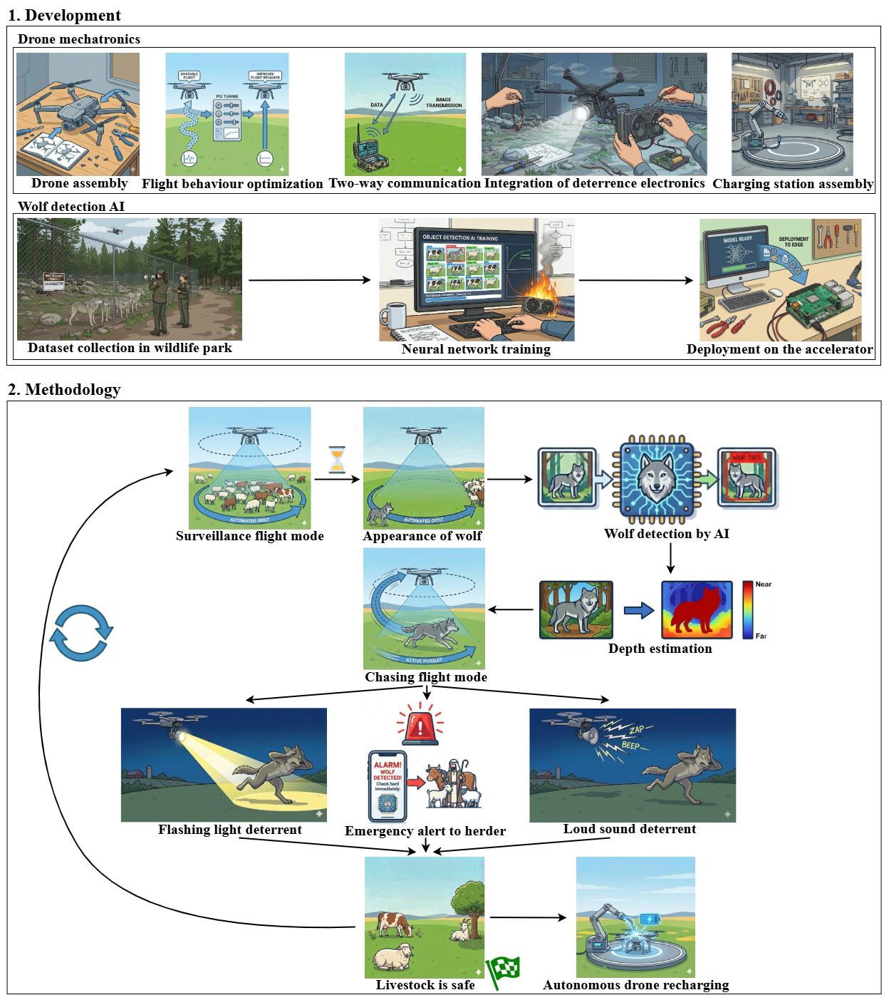

# 📘 Development of an Autonomous Drone System for Wolf Perception, Deterrence, and Livestock Protection 
## 🔗 Online Access

- Thesis: <https://drive.google.com/drive/folders/1ag495ByeFjiVlfqUUsdaL6ZCu044Agzx>
- Demonstration Footage: <https://drive.google.com/drive/u/1/folders/1iq1sal4j-2BdYo_iQWTh4zervpIA7H4Y>
- Project Video: <https://drive.google.com/drive/folders/1frauV_XionrSbwKy0DaJ-vTSHqZqgdBe>
- GitHub Repository of Wolf Detection AI: <https://github.com/jostoelz/Wolf-Detection-AI>
- GitHub Repository of Autonomous Drone Charging Station: <https://github.com/jostoelz/Autonomous-Drone-Charging-Station>

## 🔍 Abstract
This Matura thesis presents a novel approach to reducing wolf attacks on livestock in Switzerland through the use of autonomously flying drones. As part of this practice-oriented project, a self-trained Artificial Intelligence (AI) model for detecting wolves and livestock is developed, achieving a 17.5-times higher processing speed than ChatGPT and an IoU value of 0.81 compared to ChatGPT’s 0.01. In addition, a depth model is optimized and modified for real-time deployment, reaching a throughput of 42.9 FPS. Several flight modes are designed and implemented, including a surveillance mode that achieves an average relative error of 2.88% during observation. A chasing flight mode is also implemented, enabling the drone to follow a wolf-like object. The flight behavior of the self-assembled Duckiedrone DD24 is improved, and discrepancies between sensor data are detected and addressed. Drone-mounted deterrent mea-
sures such as light and sound are installed, reaching volumes of over 105 dB. In the event of a wolf detection, an emergency alert is sent to the herder’s phone. Furthermore, a self-designed and constructed autonomous drone charging station is presented. By scaling up the developed technology, livestock could be monitored and protected around the clock in the future without the need for manual supervision.

## 📖 Citation

If you find this project useful for your research, please consider citing it:

```bibtex
@thesis{Stoelzle2024,
  author       = {St{\"o}lzle, Johannes},
  title        = {Development of an Autonomous Drone System for Wolf Perception, Deterrence, and Livestock Protection },
  school       = {Kantonsschule Romanshorn},
  year         = 2026,
  type         = {Matura Thesis},
  url          = {[https://github.com/jostoelz/Autonomous-Drone-System-for-Wolf-Detection-Deterrence-and-Sheep-Protection)}
}
```

## 🧭 Visual Overview

<p align="center">
  
  <br/>
  <em>Overview of system development and operational methodology.</em>
</p>

## 📜 License

[](https://opensource.org/licenses/Apache-2.0)

This project is licensed under the Apache License 2.0 - see the [LICENSE](LICENSE) file for details.

---
✨ Enjoy exploring the thesis materials. 
